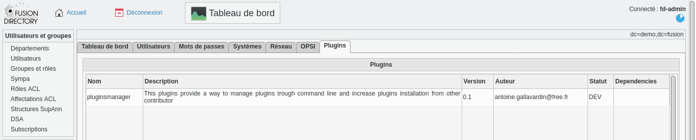

# fusiondirectory-plugins-pluginsmanager

This plugins is designed to manage list of plugin installed on your Fusiondirectory
It could check
  * PHP objectClass
  * Ldap schema
  * show information about plugin (as author, version, compatibility)
## Why this plugin ?

There is not simple way to list availbale and enable plugins

## How does it works ?

A yaml file must be created for each plugins in the root folder with the following name "control.yaml"
This yaml file should be imported inside FD trough the `fusiondirectoy-plugin-manager` command provided.
This importation must create a record inside LDAP tree a sub ou inside fusiondirectory called `ou=plugins`
There one entry per plugins installed.
This file is used for adding plugin inside the FusionDirectory Market


## Yaml file

### Global information
The control is inspired by Debian control file used for packaging.
There is 4 parts:

  * information : Mandatory for defining the plugin and register the plugin inside the Fusiondirectory market and current Fusiondirectory instance.
  * support : indication is mandatory, content must corresponding to the support provided : community is a reserved word for non-company support.
  * requirement : indication is optionnal but it's encouraged to fill  it
  * content : optionnal informations wich are used for installing / checking installation / removing plugin

### Section `information`

#### Syntax

| keyword | presence | description |
| ---- | ---- | ---- |
| name | mandatory | identifier of plugin (small string) |
| description | mandatory | description of plugin (long string) |
| version | mandatory | version of plugin (small string like X.Y)|
| authors | mandatory | Array of author(s) mail address|
| status | mandatory | "Development" or "Stable"|
| screenshotUrl | recommended | Array of Url of screenshot file ( png/gif/jpg)|
| logoUrl | recommended | one url linke to the logo file|
| tags | recommended | Array of tag uses for sorted plugins in market|
| license | mandatory | identifier of the license used like : GPLv2|
| origin | mandatory | "Source" or "Package", it's used by the install script, if Package is specified, the script won't install/remove the plugin|

#### Example
```
information:
  name : notes
  description : "This plugins provide a way to add some notes per each Fusion Directory Object"
  version : "0.1"
  authors :
    - "author@domain.fr"
  status : Development
  screenshotUrl:
   - https://raw.githubusercontent.com/gallak/fusiondirectory-plugins-notes/main/contrib/doc/capture1.png
  logoUrl : "https://github.com/gallak/fusiondirectory-plugins-notes/logo.png"
  tags: ["information","notes","plugin" ]
  license: "GPLv2"
  origin: "source"
```

### Section `support`

#### Syntax

| keyword | community      | pro | description |
| ---- | ----------------- | ---- | ---- |
| provider | mandatory      | provider of support : "community" or name of the company |
| homeUrl | mandatory      | mandatory | Link to the homepage of plugin                                               |
| ticketUrl | recommended  | mandatory | Link to the ticket system of plugin                                          |
| discussionUrl| recommended| mandatory | Link to the discussion page of plugin chat / forum                          |
| downloadUrl  | mandatory | mandatory | Link to the archive of the plugin                                            |
| schemaUrl | recommended  | mandatory | Link to the LDAP schema used by plugin                                       |
| contractUrl | none       | mandatory | Link to the company page wich proposed professionnal support for this plugin |


#### example of community support section
```
support:
  provider : community
  homeUrl : "https://github.com/gallak/fusiondirectory-plugins-notes"
  ticketUrl : "https://github.com/gallak/fusiondirectory-plugins-notes/issues"
  discussionUrl : "https://github.com/gallak/fusiondirectory-plugins-notes/wiki"
  downloadUrl: "https://github.com/gallak/fusiondirectory-plugins-notes/archive/refs/heads/main.zip"
  schemaUrl : "https://schemas.fusiondirectory.info/"
```
#### example of professional support section
```
support:
  provider: fusiondirectory
  homeUrl : "https://github.com/gallak/fusiondirectory-plugins-notes"
  ticketUrl : "https://github.com/gallak/fusiondirectory-plugins-notes/issues"
  discussionUrl : "https://github.com/gallak/fusiondirectory-plugins-notes/wiki"
  downloadUrl: "https://github.com/gallak/fusiondirectory-plugins-notes/archive/refs/heads/main.zip"
  schemaUrl: "https://schemas.fusiondirectory.info/"
  contractUrl: https://www.fusiondirectory.org/abonnements-fusiondirectory/
```

### Section `requirement`

| keyword | presence | description |
| -------- | ---- | ---- |
| fdVersion| mandatory | Minimal version  of FusionDirectory need for this plugin (small string)|
| phpVersion | mandatory | Minimal version  of PHP need for this plugin (small string)          |
| plugins | optionnal | List of plugins dependency
#### example
```
requirement:
  fdVersion : 1.4
  phpVersion : 7.2.0
```

### Section `content`

This section is optionnal.

| keyword | presence | description |
| ----------- | ---- | ---- |
| phpClassList| mandatory (if section is present)| PHP object classe used inside plugin          |
| ldapObjectList   | mandatory (if section is present)| LDAP object classe needed by the plugin  |
| ldapAttributeList| mandatory (if section is present)| LDAP Attributes list needed by the plugin|
| fileList         | mandatory (if section is present)| List of file used byt the plugins        |

#### Example
```
  phpClassList : ['notes']
  ldapObjectList : ['fdNotesObject']
  ldapAttributeList : ['fdNotes']
  fileList :
  - './admin/systems/notes/class_notes.inc'
```


## How to install

`git https://github.com/gallak/fusiondirectory-plugins-pluginsmanager.git
mv fusiondirectory-plugins-pluginsmanager pluginsmanager`

### Installation of ldap schema

`ldap-schema-manager -i ./pluginsmanager/contrib/schema/pluginsmanager-fd.schema`

### Installation of plugin

```fusiondirectory-setup --set-fd_home=/usr/local/share/fusiondirectory --install-plugins
Setting fd_home to /usr/share/fusiondirectory
Installing FusionDirectory's plugins
Where is your plugins archive or folder?:
<complete current path>
Available plugins:
1:pluginsmanager

fusiondirectory-setup --update-cache --update-locales
```

### Installation of binary plugin manager

```cp fd-plugins/pluginsmanager/fusiondirectory-plugin-manager /usr/local/bin/`
chmod u+x /usr/local/bin/fusiondirectory-plugin-manager```


### Usage fusiondirectory-plugin-manager


Fusiondirectoy-plugin-manager is a tool to manage plugin developped by community
Install a plugin means
  - copy file in several place
  - register plugin inside FD installtion
  - scan all PHP classe
  - rebuild all language file

options are
  - set-fd_home=FD PATH' : path of fusiondirectory installtion
  - plugins-archive=SRC_PATH : path of directory ( or gz archive) of plugins to scan
  - plugin-name=plugin name : name of plugin ( contain in control.yaml file)

Actions are
  - --install-plugin : install plugin inside FD installation
  - --only-register : register plugin inside FD installtion
  - --list-plugins : show all community plugins installed
  - --display-plugin-file : see all files declared in plugin
  - --remove


#### Plugins liste inside dashboard

Some informations are available trough FusionDirectory web interface on the dashboard.




#### Examples with fusiondirectory-plugin-manager

##### install plugin from source folder

```
./fd-plugins/pluginsmanager/fusiondirectory-plugin-manager --set-fd_home=/usr/local/share/fusiondirectory --plugin-name=notes --plugins-archive=/usr/local/src/fd-plugins --install-plugin
Setting fd_home to /usr/local/share/fusiondirectory
plugin notes will be used
Plugins folder /usr/local/src/fd-plugins will be used
Install only Ldap record of plugin
Installing plugin notes
ajout yaml
Plugin record exist : cn=notes,ou=plugins,ou=fusiondirectory,dc=demo,dc=fusion
Deleting it !
Create plugin record
 COPY : /usr/local/src/fd-plugins/notes/admin//*   = > /usr/local/share/fusiondirectory/plugins/admin/
 COPY : /usr/local/src/fd-plugins/notes/config//*   = > /usr/local/share/fusiondirectory/plugins/config/
 COPY : /usr/local/src/fd-plugins/notes/html//*   = > /usr/local/share/fusiondirectory/html/
 COPY : /usr/local/src/fd-plugins/notes/include//*   = > /usr/local/share/fusiondirectory/include/
 COPY : /usr/local/src/fd-plugins/notes/contrib/openldap//*   = > /usr/local/share/fusiondirectory/contrib/openldap/
 COPY : /usr/local/src/fd-plugins/notes/locale//*   = > /usr/local/share/fusiondirectory/locale/plugins/notes/locale/
Scanning and update Class.cache and translations
```

##### register plugin inside FusionDirectory installation

```
./fd-plugins/pluginsmanager/fusiondirectory-plugin-manager --set-fd_home=/usr/local/share/fusiondirectory --plugin-name=notes --plugins-archive=/usr/local/src/fd-plugins --only-register

Setting fd_home to /usr/local/share/fusiondirectory
plugin notes will be used
Plugins folder /usr/local/src/fd-plugins will be used
Installing FusionDirectory's plugins
Installing plugin notes
Plugin record exist : cn=notes,ou=plugins,ou=fusiondirectory,dc=demo,dc=fusion
Deleting it !
Create plugin record
Scanning and update Class.cache and translations
```

##### list installed plugins

```
root@fd-14-dev:/usr/local/src# ./fd-plugins/pluginsmanager/fusiondirectory-plugin-manager --set-fd_home=/usr/local/share/fusiondirectory  --list-plugins
Setting fd_home to /usr/local/share/fusiondirectory
List installed FusionDirectory plugins
There are 4 Plugins configurations in the LDAP
 Plugin :account
   - name   : account
   - description    : FAKE plugin to test dependancie
   - author :
   - version    :
   - homeUrl    : https://github.com/gallak/fusiondirectory-plugins-account
 Plugin :urbackup
   - name   : urbackup
   - description    : plugins which allow interactiong systeme and their urbackup configurations
   - author :
   - version    :
   - homeUrl    : https://github.com/gallak/fusiondirectory-plugins-urbackup
 Plugin :pluginsmanager
   - name   : pluginsmanager
   - description    : plugins which allow to managezr plugin, check consistencie
   - author : antoine.gallavardin@free.fr
   - version    : 0.1
   - homeUrl    : https://github.com/gallak/fusiondirectory-plugins-pluginmanager
 Plugin :notes
   - name   : notes
   - description    : plugings which allow user to add some notes on eache FD object
   - author : antoine.gallavardin@free.fr
   - version    : 0.1
   - homeUrl    : https://github.com/gallak/fusiondirectory-plugins-notes
root@fd-14-dev:/usr/local/src#
```

##### Show plugins file

```
root@fd-14-dev:/usr/local/src# ./fd-plugins/pluginsmanager/fusiondirectory-plugin-manager --plugin-name=urbackup --set-fd_home=/usr/local/share/fusiondirectory  --show-plugin-files
plugin urbackup will be used
Setting fd_home to /usr/local/share/fusiondirectory
Show all files deleared for this plugins
Plugin urbackup contains following files
 - ./include/urbackup/class_urbackup.php
 - ./include/urbackup/test.php
 - ./config/urbackup/class_urbackupConfig.inc
 - ./admin/systems/urbackup/class_urbackupClient.inc
 - ./admin/systems/urbackup/urbackup_client.tpl
 - ./admin/systems/urbackup/urbackup_backup.tpl
 - ./admin/systems/services/urbackup/class_serviceUrbackup.inc
 - ./locale/fr/fusiondirectory.po
 - ./locale/en/fusiondirectory.po
root@fd-14-dev:/usr/local/src#

```


##### Remove plugin file

```
root@fd-14-dev:/usr/local/src# ./fd-plugins/pluginsmanager/fusiondirectory-plugin-manager --plugin-name=notes --set-fd_home=/usr/local/share/fusiondirectory  --remove-plugin
plugin notes will be used
Setting fd_home to /usr/local/share/fusiondirectory
Delete one plugins
Plugin notes is declared
Plugin notes is NOT necessary for other plugins
Files of pluginnotes will be removed !!
Are you Sure (yes/NO)?
 [no]:
yes
Plugin notes contains following files
 DEL FILE : /usr/local/share/fusiondirectory/plugins/./admin/systems/notes/class_notes.inc
Ldap record of pluginnotes will be removed !!
Are you Sure (yes/NO)?
 [no]:
yes
Scanning and update Class.cache and translations
root@fd-14-dev:/usr/local/src#


```
### Additional Informations

#### Sides effect

As `fusiondirectory-plugins-manager` command install plugins it could remove plugins

Yaml file could be used to add quickly plugins on future https;//plugins.fusiondirectory.org website.

This website could provide a list of plugin wich are available to install .

A tool could created in order to provide `control.yaml` file from RPM/DEB/TGZ plugin archive

This tool didn't remove ldap schema or old data stored in LDAP tree

